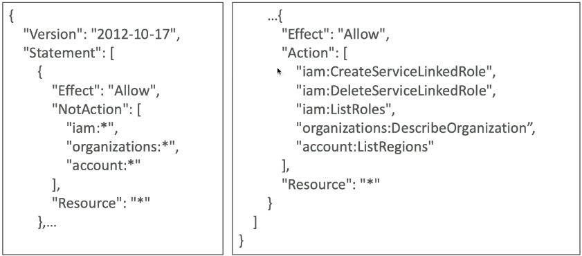
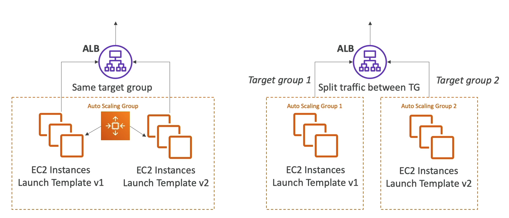
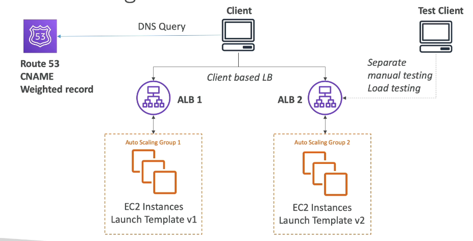
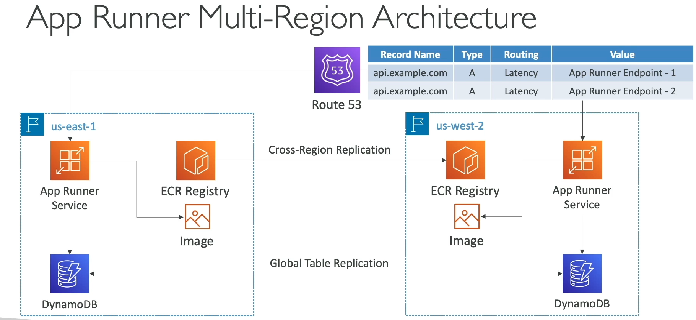
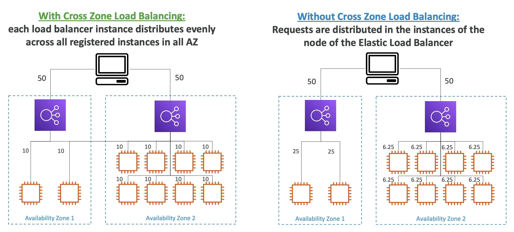
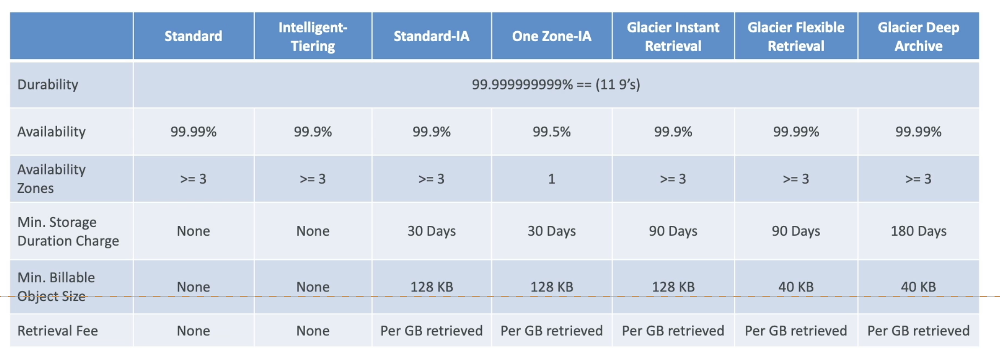
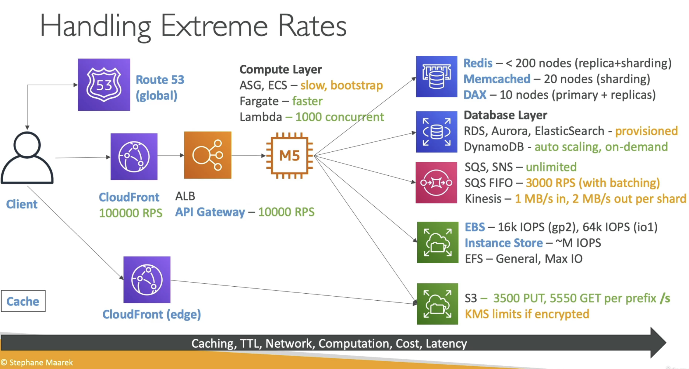
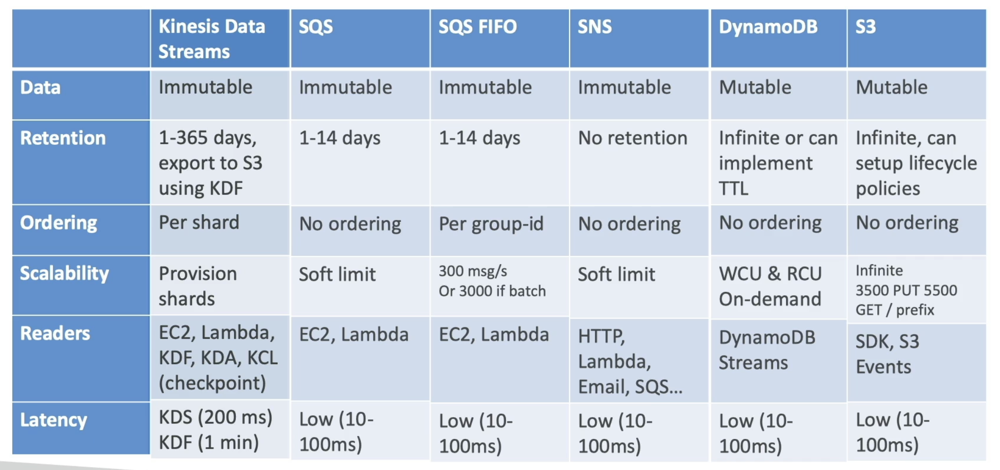

# AWS Solutions Architect Professional (SAP-C02) 

## Exam Notes

Notes based on course: https://www.udemy.com/course/aws-solutions-architect-professional/

Notes based on my previous knowledge: some things might have been left out on purpose

## Identity & Federation

### IAM

- It's a good idea to use "Efect": "Allow" and a conjunction of "NotAction" and "Action" to give specific permissions.



#### IAM Policies variables and Tags

- AWS Specific: aws:CurrentTime, aws:TokenIssueTime, aws:SecureTransport, aws:SourceIp

- Service Specific: s3:prefix, sns:Endpoint, sns:Protocol

- Tag Based: iam:ResourceTag/key-name, aws:PrincipalTag/key-name

### STS

- To avoid Confused Deputy problem then use External ID

#### Session Tags

- aws:PrincipalTag conditions: to compare the tags attached to the principal making the request witht the tag you specified in the policy.

- very useful in Federation

#### Important APIs

- AssumeRole, AssumeRoleWithSAML, AssumeRoleWithWebIdentity (returns creds for users logged with OIDC, **AWS currently recommends using Cognito instead of this**), GetSessionToken (for MFA), GetFederationToken

### Federation in AWS

- Use cases: a corporate has its own identity system (AD) or Web/Mobile app needs access to AWS resources

- Flavors: SAML, Custom Identity Broker, Web Identity Federation With(out) Cognito, SSO (IDC).

#### SAML

- Uses STS API call: **AssumeRoleWithSAML**

- Is considered **the old way** in favour of Amazon SSO (IDC) Federation (new managed and simpler way)

#### Custom Identity Broker (no SAML)

- Implement similar logic than SAML but in a custom way (IdP)

- Usese API call **GetFederationToken**

#### Web Identity Federation

- Without Cognito: *not recommended*, exchanges web identity token for temporary security credentials using API call **AssumeRoleWithWebIdentity** of STS.

- With Cognito: *preferred (mostly web and mobile apps)*, exchanges ID token for Cognito token and then for temporary security credentials. Benefits: supports anon users, MFA and data sync.

- You can use IAM policy variables like ${cognito-identity.amazonaws.com:sub}, ${www.amazon.com:user_id}, ${accounts.google.com:sub}

### AWS Directory Services

#### AWS Managed Microsoft AD

- You own AD in AWS:

    - Manage users locally

    - 2 DC in != AZ at minimum

    - Domain join EC2 instances from multiple accounts and VPCs

    - Integrates with RDS for SQL, AWS Workspaces, Quicksight, AWS SSO (SAML)

    - Establish trust connections with on-prem AD: needs VPN or Direct Connect. There is one-way trust or two-way trust (forest trust) -> this is NOT sync/replication, each AD has its own users independently but talk to each other.

    - *Replicatio*n*: if this is needed then an AD on EC2 self-managed replica is needed in the cloud so the on-prem AD replicates to this cloud AD and then establish a trust to the AWS Managed AD

- Supports MFA

- Needs VPN or Direct Connect to connect to on-prem

#### AD Connector

- Gateway/Proxy to redirect to on-prem AD: 

    - Users are managed on-prem

    - No caching capabilities

    - Doesn't integrate with SQL Server, can't sahre directory

    - needs VPN or DC

#### Simple AD

- AD compatible managed directory on AWS: samba4

    - Inexpensive 

    - Doesn't support MFA, SQL Server, SSO, etc

    - Can't be joined with on-prem AD

    - Small: 500 users, Large: 5000 users

### AWS Organizations

- **OrganizationAccountAccessRole** IAM Role is created with a new Member account (FullAdmin permissions) and assumed by entities in the Management Account

    - Must be created manually if AWS Account is invited to the Org

- Features modes:

    - Consolidated billing: single payment method, pricing benefit from aggregated usage.

    - All features (default): includes consolidated billing, adds SCP, can't switch back to consolidated billing

- Reserved instances: 

    - All accounts can receive the hourly benefit of *Reserved Instances* that are purchased by any other account

    - Management account (payer) can turn off RI discounts and Savings Plans discount sharing for any account, including the payer. If want to share then both accounts should have it on.

#### SCP

- Does not apply to the Management Account

- Applies to all Users and Roles including Root user but doesn't affect Service-Linked roles

- Must have an explicit Allow (FullAWSAccess) from the root and on each OU in the path to the target account (if you don't add this then the account on that OU won't have the permissions)

##### Tag Keys

- To validate Tags attached to a resource

- Using aws:TagKeys condition key

- ForAllValue (must have all keys) or ForAnyValue (must have any of these keys at a minimum)

##### Tags for resource creation

- Prevent creating resources without specific tags

```
"Effect": "Deny",
"Condition":{
    "Null": {
        "aws:RequestTag/TAG-KEY": "true"
    }
}
```

##### Region Deny

- Using aws:RequestRegion condition key

- Used to explicitly deny something for a specific region

#### Tag Policies

- Standarize tags across resources in Org

- Define Tag keys and their allowed values

- Prevents any non-compliant tagging operations on specified services and resources. Generate a report for non-compliant. EventBridge to monitor non-compliant

#### AI opt-out Policies

- This helps on enforcing an opt-out policy applied to all member accounts and Regions: by OU, account or at the Root.

- All services or selected ones: Lex, Comprehend, Polly, etc

#### Backup Policies

- Granular control over backing up resources: frequency ,time windows, region, etc

- Attached to OU, Root, or specific accounts

- Immutable Plans: appear as view ONYL in members

### AWS Identity Center

- Supports EC2 Windows instances, CloudApps and SAML enabled apps

### AWS Control Tower

#### Guardrails

- Mandatory, Strongly recommended and Elective controls.

- Detective (Config) and Preventive (SCP) controls.

### AWS Resource Access Manager

- Avoid resource duplication.

- Share with any account or within Org

- VPC Subnets:
    
    - Must be from the same Org

    - Participants can't view/modify resources that belong to other participants or the owner

    - Can't share SG and default VPC

    - Anything deployed in the VPC can talk to other resources (communication via private ip), SG from other accounts can be referenced.

    - Good for: apps with the same trust boundaries and high degree of interconnectivity.

- Managed Prefix List: a set of one or more CIDR blocks that makes it easier to configure and maintain SG and route tables

    - Customer-managed or AWS-managed

    - If shared then can be referenced from other accounts (i.e inbound rule on SG) and changed "centrally"

- Route 53 Outbound Resolver: helps scale forwarding rules to your DNS in case you have multiple accounts and VPC.

        - Share then Accept then Associate so other accounts can resolve based on the shared rules

- AWS Transit Gateway, Route 53 (resolver rules, DNS Firewall rule groups), License Manager Configurations, Aurora DB cLusters, ACM Private CA, AWS Glue, AWS Network Firewall Policies.

### Exam tips:

- Prefer Cognito or SSO (IDC) over SAML or Web Identity Federation

- For cross-account access if there are permission needed on the same account and on other account then its preferred to have resources policies setup on the cross-account resource rather than assuming a role on the target account that has permission on the resource.

## Security

### CloudTrail

- CloudTrail Insights only detects anomalies on **write** events and send the findings to CT console, s3 or EventBridge

### KMS

- Key source == EXTERNAL then you download PubKey and Import Token -> Encrypt Key Material with PubKey -> Import encrypted key material with Import Token

- Multi-Region keys are supported: same key material, ID, rotation. Not global: principal + replicas

### Parameter Store

- Can reference a Secrets Manager secret (/aws/reference/secretsmanager/Secret-ID)

- 2 tiers: Standard (10K parameters, 4KB max size, No policies, Free) and Advanced (100K parameters, 8KB max size, Has policies (TTL for expiration and notifications), Price)

### Secrets Manager

- Native rotation support for RDS, DocumentDB, Redshift, for other sources use custom Lambda.

- For cross-account secret sharing then:

    - kms:Decrypt action is needed with condition kms:ViaService -> secretsmanager in KMS key policy
    - secretsmanager:GetSecretValue action on the RBP

### ACM

- Regional service: create certificates on each Region for Global apps, can't copy certs (if using ALB)

### CloudHSM

- Can be used for SSL offloading: EC2 instances with apache,nginx,iis can offload the SSL operation to CloudHSM using a cryptographic user so it doesn't take CPU on the instances.

    - SSL keys never leave the HSM device -> most 
    
### S3

#### Encryption

- With SSE-KMS the public objects can't be read. s3:PutObject also needs the permission kms:GenerateDataKey

#### Policies

- For usage with VPCe then the conditions aws:SourceVpc and aws:SourceVpce are used. Otherwise aws:SourceIP is used for public internet.

#### Access Points

- Has a Policy similar to a Bucket Policy. 

- Has its own DNS name (Internet Origin or VPC Origin (via VPCe and permissions on the Endpoint Policy as well))

- Advantage: have a very simple BP and create AP with specific policies and permissions for specific Users.

- Multi-Region Access Points:

    - Global Endpoint that span S3 buckets in multiple Regions

    - Dinamically route requests to the nearest S3 bucket (lowest latency).

    - It can be Active-Active or Active-Passive setups.

    - You can create replication rules to bi-directionally replicate objects between cross-region buckets so it doesn't matter which bucket you access via the MR AP.

- Object Lambda Access Points:

    - Use a Lambda to change the object before it is retrieved by the caller app

    - Create an AP on top of the S3 bucket, then a Lambda to modify the retrieval of objects and then a S3 Object Lambda Access Points that the app is going to use to retrieve the objects.

    - Use cases: redacting PII, converting data across formats, adding a watermark to an image based on the caller, etc

### Config

- When a rule is non-compliant you can:
    
    - Trigger EventBridge and chain it with Lambda

    - Auto-remediate with SSM Automations


## Compute & Load Balancing

### EC2

#### Instance types

- R: more RAM (in-mem cache)

- C: good CPU (compute/DB)

- M: balanced (general/webapp)

- I: good local I/O (databases)

- G: with GPU (video rendering/machine learning)

#### Graviton

- Best price performance. G2 40% better price than 5th x86 instances, G3 3x better performance than G2.

- Supports many LX: AMZ LX 2, RedHat, SUSE, Ubuntu. NOT for Windows.

- For apps servers, HPC, CPU-based ML, video encoding, gaming, in-memory cache.

#### Placement groups

- Group strategies:

    - Cluster: Packs instances close together into a low-latency group in a single AZ.

        - Same rack, same AZ

        - **Pro**: Great networking - **Con**: rack fails, all fail.

        - Better if instance type == Enhanced networking is used.

        - Typical for HPC apps. Big Data jobs. Apps with extremly low latency and high network throughput.

    - Partition: Spreads your instances across logical partitions such that groups of instances in one partition do not share the underlying hardware with groups of instances in different partitions.
    
        - Different racks (for different partitions), same AZ

        - Partition failure only affects instances on the same partition

        - Typical for Hadoop, Cassandra, Kafka. 

    - Spread: Strictly places a small group of instances across distinct underlying hardware to reduce correlated failures.

        - Different hardware, different AZ

        - **Pro**: span across AZ, low risk on simultaneous failure, instances on different hardware - **Con**: MAX 7 instances per group per AZ

        - Typical for apps that need maximize HA, critical apps where instances need to be isolated from failure.

    - To *move* from placement groups: Stop instance -> CLI (modify-insntace-placement) -> Start instance

#### Launch Types

- On-demand: short workload, predictable pricing, reliable.

- Spot instances: short workloads, cheap, non-reliable.

- Reserved: MINIMUM 1 year

    - Standard RI: for long workloads

    - Convertible RI: you can change the instance families, OS, etc. Less discount than Standard RI.

    - All upfront payment (+discount) -> Partial upfront payment -> no upfront (-discount)

- Saving plans: commitment for certain usage for 1 to 3 years

    - EC2 instance SP: same discount as Standard RI. Specific instance family and region. Flexible size, os.

    - Compute SP: same discount as Convertible RI. Flexible instance family, region and compute type, os.

    - SageMaker SP

- Dedicated instance: no other customer shares your hardware. No control over instance placement.

- Dedicated hosts: entire physical server. Complete control over placement on the server. Great for software licenses that operate at the Core/CPU socket level.

#### Metrics

- CPU utilization, Network In/Out, Status check (instance==EC2 VM, system==underlying hardware), Disk R/W for Ops/Bytes.

- NOT RAM metrics: must be obtained inside the EC2 and sent to CW custom metrics.

#### Instance Recovery

- Status check (instance status==EC2 VM, system status==underlying hardware)

- If CW Alarm is triggered then the action EC2 Instance Recovery can be used to recover: Same Private/Public/Elastic IP, Metadata, Placement Group.

#### High Performance Computing (HPC)

- Combination of infra components that maximizes the performance of computing.

- Great for: genomics, computational chemistry, financial risk modeling, autonomous driving, ML, Deep Learning, etc.

- For Data and Transfer:

    - Direct Connect: move GB/s over a private network.

    - Snowball: move PB

    - DataSync: move large amount of data between on-prem and S3, EFS, FSx for Windows. Needs an agent to be installed.

- For Compute and Networking:

    - EC2 instances: CPU/GPU optimized, Spot Instances/Fleets (cost savings) + Auto Scaling

    - EC2 placement groups: Cluster placement is good for network performance (low latency, 10GBps network)

    - EC2 Enhanced Networking (SR-IOV): higher bandwidth, higher packets-per-second, lower latency.

        - Elastic Network Adapter (ENA): up to 100 Gbps.

        - Intel 82599 VF: up to 10Gbps - LEGACY

        - Elastic Fabric Adapter (EFA): improved ENA for HPC and tightly coupled workloads. Only for LINUX (bypasses the underlying OS to provide low latency)

- For Storage:

    - EBS: up to 256K IOPS (with io2 Block Express)

    - Instance store: millions of IOPS. Low latency but can be lost.

    - Network storage:

        - S3: large blob, not FS.

        - EFS: scale IOPS based on size or use provisioned IOPS.

        - FSx for Lustre: HPC optimized. Millions of IOPS. Backed by S3

- For Automation/Orchestration:

    - Batch: multi-node parallel jobs (across multiple EC2). Easily schedule jobs and launch instances accordingly.

    - ParallelCluster: oss cluster management tool to deploy HPC on AWS. Configured with txt files. Automates the creation of VPC, Subnet, cluster types and instance types.

### Auto Scaling Groups

#### Scaling Policies

##### Dynamic 

- Target Tracking Scaling: most simple, i.e ASG CPU average around 40%

- Simple/Step Scaling: based on CW Alarm trigger

- Scheduled Actions: for known usage patterns

##### Predictive

- Analyze historical load, generate a forecast and then schedule scaling actions ahead

#### Metrics to scale on

- CPUUtilization: average CPU utilization across your instances

- RequestCountPerTarget: number of requests per EC2 instances is stable

- Average Network In/Out: if app is network bound

- Any custom CW metric

#### Considerations

- ASG support Spot Fleet: mix spot and on-demand instances)

- Lifecycle hooks: actions before instance is in service or terminated (i.e cleanup, log extraction)

- Health checks: 

- Upgrade AMI: update Launch configuration/template and then terminate instance manually or use EC2 Instance Refresh for Auto Scaling (automatically terminates instances and creates new ones using the updated launch template, min healthy % can be set, warm-up time can be set)

#### Update strategies

- Using same ALB, Same ASG, new Launch Template version

- Using same ALB, Different ASG, new Launch Template version


 

- Using new ALB (redirection based on R53 weighted records), Different ASG, new Launch Template version 



### Spot Instances

- Up to 90% discount vs on-demand. Used for batch jobs, resilient to failures workloads, data anlysis.

- If current spot price < max spot price => get the instances; then if current spot price > max spot price => you can choose to stop/terminate within 2m

### Spot Fleet

- Set of Spot Instances + on-demand instances (optional)

- Will try to meet target capacity with price constrains defined via possible launch pools (instance type, OS, AZ). Allow us to automatically request Spot Instances with the **lowest price**

- Can have multiple launch pools from which the fleet can choose. Stops launching instances when reaching capacity or max cost

- Strategies to allocate Spot Instances:

    - lowestPrice: from the pool with lowest price (cost optimization, short workloads)

    - diversified: distributed across all pools (great for availability, long workloads)

    - capacityOptimized: pool with the optimal capacity for the number of instances

    - priceCapacityOptimized (recommended): pool with the highest capacity, then pool with the lowest price (best choice for most workloads)

### ECR

- Private Registry support cross-Region and cross-Account replications

### ECS
 
- Has 2 launch types: Amazon EC2 (can also use underlying Spot Instances) and Fargate (can add tasks on FARGATE_SPOT for cost-savings or specify minimum # of tasks for on-demand)

- IAM roles:
        
    - EC2 Instance Profile (EC2 only)-used by ECS agent, makes API calls to ECS service, sends container image from ECR, references sensitive data in Secrets Manager or SSM Parameter Store

    - ECS Task Role allows each task to have a specific role, use different roles for different ECS services you run, task role is defined in the task definition

- Uses Dyanmic Port Mapping so ALB can find the right port on the EC2 instance were multiple Tasks (instances of the app) are running

- ECS Service Auto Scaling (similar to EC2 AS): increase/decrease # fo tasks. CPU/RAM tracked in CW at Service level

#### ECS Anywhere

- Run native ECS tasks on customer-managed infra (on-prem) but the Control Plane remains fully-managed in AWS

- ECS Agent and SSM Agent are needed. "EXTERNAL" Launch Type used.

- Use cases: compliance/regulatory, latency, run apps closer to other services.

### EKS

- Data Volumes support: EBS, EFS (only one for Fargate), FSx for Lustre and FSx for NetApp ONTAP

#### EKS Anywhere

- Uses Amazon EKS Distro. Install using EKS Anywhere Installer.

- Can work without any connection to AWS. Optionally can use EKS Connector to connect EKS-A cluster to AWS (fully-connected, partially disconnected or fully-disconnected) to use the EKS console.

### App Runner

- Full managed service that makes it easy to deploy web applications/APIs at scale, requiring no infrastructure experience.

- Start with merely your code and/or container(s) to thereafter build and deploy

- VPC access support

- Automatic scaling, HA, LB, encryption

- Connect to DBs, cache, and message queue services

- Use cases: Web applications, APIs, microservices, rapid production deployments

- Multi-Region architecture:



### Lambda

#### Limits 

- RAM: 128MB (1vCPUs) to 10GB (6 vCPUs) of RAM. vCPUs can't be set manually

- Timeout: 15m

- Concurrent executions: 1000 (soft limit). Over this limit then Throttle. Reserve concurrency can be set.

- /tmp/ storage: 10GB

- Deployment packages: 50MB (zipped), 250MB (unzipped) including layers

- Container image max size: 10GB

#### Considerations

- Cloudwatch and X-Ray are supported

- Lambda in VPC: *only* has internet access if deployed on private subnet and route traffic through NAT GW

- For synchronous invocations (CLI, SDK, API GW) the retries must happen client side, for asynchronous invocations (SNS, S3, EventBridge) there are 3 retries on errors and then DLQ.

### Load Balancers

#### ALB (L7)

- Latency: ~400ms

- ALB can route to multiple target groups (EC2 instances, ECS tasks, Lambda functions, private only IP)

#### NLB (L4)

- Latency: ~100ms

- Static IP: 1 per AZ. Regional DNS Name resolves to each IP on each AZ but Zonal DNS Name resolves to specific IP on AZ (i.e prefixing the *us-east-1a*)

- NLB can route to EC2 instances, private only IPs, ALB

#### GLB (L3)

- To load balance traffic to 3rd party network virtual appliances: firewalls, IDS/IPS, Deep packet inspection, payload manipulation, etc

- Uses GENEVE protocol port 6081

- GLB can route to EC2 instances, private only IPs

#### Cross-Zone Load Balancing

- CLB/NLB/GLB: disabled by default // ALB: enabled by default (can't be disabled)

- CLB/ALB: no charges for inter AZ data // NLB/GLB: pay charges for inter AZ data



#### Request routing algorithms

- Least Oustanding Requests (ALB/CLB): next instance is the one with lowest number of pending/unfinished requests

- Round Robin (ALB/CLB): instance selected equally from target group.

- Flow Hash (NLB): target selected from a hash calculated from protocol, source/destination ip/port, tcp seq number.

### API Gateway

- Advantages: API versioning, caching (from 0s to 3600s, default 300s; up to 237GB), authorization, traffic management (API keys, throttles), scalability, serverless, request/response transformations, OpenAPI specification, CORS

- Limits: 29 seconds timeout, 10MB payload size, 10K requests per second.

- Deployments into Stages (as many as you want and with any name) that can be rolled back

- Integrations: HTTP (expose any http endpoint), Lambda functions, AWS Services (to add a layer of authentication, deploy publicly, rate control)

- Types:

    - Edge-Optimized (default): the request are routed through a CF Edge location (improved latency) but the API GW still lives in a specific region

    - Regional: for clients in the same region. Can be combined with CF for control over caching strategies and distribution

    - Private: can only be accessed via VPCe and resource policy must be defined

- Errors: 4xx Client Error (400 Bad Request, 403 Access Denied, 429 Throttle/Quota), 5xx Server Error (502 Bad GW, 503 Service Unavailable, 504 Integration failure/Timeout)

#### Usage plans & API Keys

- Access control for one or more API stages and methods

- Can configure Throttle and quota limits (Error 429 Too many requests, retry mechanism must be implemented)

### AppSync

- Managed service that uses GraphQL. Authorization with Cognito based on the groups the users belong to

- Combines data from one or more sources (NoSQL data source, relational DB, HTTP APIs). Integrates with DynamoDB, Aurora, ES and custom sources with Lambda

- Retrieves data in real-time with WebSocket or MQTT

### Global Accelerator

- Provides (2) Anycast/static IP addresses providing a fixed entry point (no client cache issues=>static ip) at edge locations (from/to) to your application(s) and eliminates the complexity of managing specific IP addresses for different regions and AZs

- Always routes user traffic, leveraging the internal AWS network, to the optimal, lowest latency endpoint based on performance, reacting instantly to HealthCheck changes, user's location, and policies configured.

- Failover < 1 minute for unhealthy application(s)=>great for disaster recovery

- Good fit for **non-HTTP** use cases such as sports/gaming (UDP), IoT (MQTT), or VoIP

- Works with Elastic IP, EC2, ALB, NLB, public or private

### Route 53

- TTL mandatory for all records except ALIAS

- R53 access logs only to CloudWatch Logs

#### Alias records

- Only points to AWS Resources (xxx.amazonaws.com)

- Works for Root domains (example.com)

- Has native health checks. Free of charge.

- Targets: ELB, CF, API GW, Beanstalk, S3 websites, Global Accelerator, R53 records on same hosted zone. CANNOT be set on EC2 DNS names.

#### Routing policies

##### Simple

- No Health Check

- Can specify multiple values and the client is the one selecting which one to use

##### Multi-Value

- Associated with Health Check (optional)

- Returns multiple values (up to 8) but only healthy ones.

- NO substitute for ELB

##### Weighted

- Associated with Health Check (optional)

- % of requests that can go to specific resources

- Use cases: LB between regions, testing new app versions, etc

##### Latency-based

- Associated with Health Check (optional)

- Answer based on least latency between Client and AWS Region

##### Geolocation

- Associated with Health Check (optional)

- Answer based on Client location: continent, country, state (not latency as the previous). If overlapping then most precise location selected.

- Default answer should be created.

- Use case: restrict content distribution, website localization.

##### Geoproximity

- Answer based on geographic location of Client and Resources.

- Based on Bias to expand or contract the geographic region.

- Resources can be: AWS resources (based on AWS Region) or Non-AWS resources (specifiy latitude/longitude)

- Must use Traffic Flow: visual editor to manage complex routing decision trees.

##### IP-based

- Based on Client IP. Relate a CIDR block with corresponding endpoints

- Use cases: optimize performance, reduce network costs.

##### Failover

- Associated with Health Check (mandatory)

- For Active-Pasive architectures

#### Health Checks

- Only for Public resources. About 15 global R53 Health Checkers.

- Pass ony if endpoint responds with 2xx or 3xxx. Pass/Fail based on text of the first **5120 bytes** of the response.

- Types:

    - Monitor endpoints (applications, servers, other AWS resources)

    - Monitor other HC - Calculated HC: combine multiple results of other HC (up to 256 child HC). Can use OR, AND and NOT. Specify the % of HC to pass to make the parent pass.

    - Monitor CW Alarms: you get full control of what can be monitored. This is a good approach for private resources. CW Metric <- CW Alarm <-monitor- R53 HC

- HC integrates with CloudWatch. Example of MR failover: Use CW Alarm that is monitor by R53 HC that fires a CW Alarm that can be caught by EventBridge (or SNS) that triggers Lambda that updates R53 DNS.

#### Resolver

- Natively integrated into each Availability Zone within your AWS Region, providing a reliable and scalable solution for domain name resolution within your Virtual Private Cloud (VPC). Also called "Amazon DNS server" or "AmazonProvidedDNS".

- Resolves local domain names for EC2 instances, records for Private Hosted Zones and records for Public Name Servers.

##### Hybrid DNS

- To resolve DNS queries between VPC (R53 resolver) and on-prem/other VPC networks (other DNS resolvers).

- Works with Resolver Endpoints:

    - Inbound endpoints: DNS resolver on your network forward queries to R53 resolvers. 

    - Outbound endpoints: R53 resolvers forwards queries to DNS resolvers on your network using Resolver Rules.

    - Associated with 1 or more VPCs in the Same Region. Created in 2 AZs for HA. Supports 10K queries per second per IP

- Resolver rules (for outbound endpoints):

    - Conditional Forwarding rules: fwd queries for specific domains and all its subdomains to target IP addresses

    - System rules: selectively overrides behavior defined in previous rules

    - Auto-defined system rules: defines how queries for selected domains are resolved.

    - This rules can be shared via RAM

#### Considerations

- For Private Hosted Zones the **enableDnsHostnames** and **enableDnsSupport** must be enabled on the VPC for this to work

- DNSSEC is supported and works only for Public Hosted Zones

### Other computing services

#### Outposts

- Rack on your own datacenter. Supports: EC2, RDS, EBS, S3, EKS, ECS.

- For cases were you need to mantain control of your data or low latency with your own applications on-prem.

#### WaveLength

- WL Zones are infrastructure deployments embedded within the telecommunication providers datacenters at the edge of the 5G networks. Brings AWS services to the edge of the 5G networks.

- Traffic doesn't leave the providers network. But it has a High-bandwidth connection ti the parent AWS Region.

- Use caes: ultra-low latency (smart cities, live video streams, AR/VR, real-time gaming)

#### Local Zones

- Extend VPC to more locations. Extension of the AWS Region. Works with: EC2, EBS, ECS, RDS, Direct Connect.

- Use case: services closer to end users to run latency-sensitive apps.

## Storage

### EBS

- Linked to 1 AZ, to transfer snapshot+restore

- Can be resized up without dettaching

#### Volume types

- gp2/gp3 (SSD): general purpose, balance price/performance. IOPS 16k

- io1/io2 Block Express (SSD): mission critical low-latency or high throughput workloads. IOPS 64k/256k

- st1 (hdd): low-cost, frequently accessed, throughput-intensive workloads

- sc1 (hdd): lowest cost, less frequent accessed workloads

- Only gp and io can be boot volumes

#### Snapshots

- Data Lifecycle Manager: automation for the management of EBS snapshots and EBS-backed AMI (can't hadle snapshots taken outside DLM)

#### Multi-attach

- Attach multiple instances (same AZ) to the same EBS volume

- Only for io1/io2. Must use FS that is cluster-aware (not ex4, xfs, etc)

 ### EFS

 - Works with **LINUX** instances, can be multi-AZ and works with on-prem (via VPN or DX)

 - Has a SG attached

 - Support Cross-region replication

 - Access points can be used to restrict access to different paths: it uses IAM policies, enforces POSIX user/groups and root directory. 

 - File system policies can be defined (similar to S3 Bucket Policies). By default is a full access to all clients.

 #### Performance

 - Performance modes (set at creation time):

    - General purpose (default): for latency sensitive use cases

    - Max I/O: more latency but higher throughput and highly parallel

- Throughput modes:

    - Bursting: increases with the storage

    - Provisioned: set throughput regardless of storage size

    - Elastic: scales up/down depending on workloads. For unpredictable workloads.

#### Storage classes

- Tiers (implemented via lifecycle policies):

    - Standard: frequent accessed files

    - IA: infrequent access

    - Archive: rarely accessed

- Availability:

    - Standard: Multi-AZ

    - One Zone: one AZ

- Storage Class Analysis: helps decide when to transition objects to right storage class. Only works with Standard and Standard-IA (not One-Zone or Glacier)

### S3

#### Storage classes



#### Performance

- 3500 PUT/COPY/DELETE requests per second per prefix and 5500 GET/HEAD requests per second per prefix. If you have a file in different prefix then this are added up.

- For uploads:

    - Muti-part upload: recommended for > 100MB, mandatory for > 5GB files. Can define a lifecycle policy to delete incomplete multi-part uploads after X number of days

    - Transfer acceleration can be used to increase file transfer by transfering files to edge location and this forwards to destination S3 bucket. Compatible with multi-part upload.

- For downloads: 

    - Byte-range fetch: parallelize GETs by requesting specific byte ranges. Can also be used to fetch a file header.

### FSx

- It's like what RDS does for DBs: you launch 3rd party highperformance FS on AWS.

#### Windows FS

- Can be mounted on Linux EC2 instances.

- SSD and HDD supported options. 

- Multi-AZ and data backed up to S3.

    - To migrate from Single-AZ to Multi-AZ you use DataSync on a new FSx with M-AZ or make a backup/restore on the new FSx.

    - You can't reduce size and to do it you have to create a new FSx that is smaller and DataSync.

### Lustre (Linux Cluster)

- For High Performance Computing (HPC)

- Data Lazy Loading: only the data that is actually processed is loaded. When the client needs it then it's loaded from S3 to reduce requests and costs.

### NetApp ONTAP

- Supports iSCSI protocol

- Supports data de-deuplication and point-in-time instantaneous cloning

### OpenZFS

- Also supports pint-in-time instantaneous cloning but NO de-deduplication.

### Deployment options

- Scratch FS:

    - For short-term processing and optimize costs

    - Data is NOT replicated

    - HIGH burst

- Persistent FS:

    - For long-term processing and sensitive data

    - Data is replicate in same AZ

### DataSync

- Move large amount of data to and from: supports S3, EFS, FSx.

- Works on schedule, not real-time.

- PRESERVES metadata of files (compatible with POSIX, SMB)

- On-prem or other cloud to AWS -> Agent needed

- AWS to AWS -> no Agent needed

- Can use up to 10GBps (or limit can be setup). If not enough bandwidth then Snowcone can be used (has a DataSync agent pre-installed) to take data from on-prem and take it offline to AWS

### Data Exchange

- Find, subscribe and use 3rd party data in the cloud.

- Subscribe and the use the API to load data into S3/Redshift and then use analytics tools.

### Transfer Family

- File transfer in/out S3 and EFS using FTP/FTPS/SFTP

- By default it uses Public IPs that can change. You can attach EIP to have static IP and use SG. Can also be referenced by R53.

- Authenticate using store credentials or external Okta, AD, Cognito, etc.

## Caching

### Cloudfront

- Origins: S3, Media Services, EC2 instances, ALB, API GW, any HTTP backend.

- Origin Groups: to increase HA, you use one primary and one secondary origin (can be cross Region)

- Geo restriction: for copyright use cases, the header Cloudfront-Viewer-Country is added on a Lambda@Edge function

- Price classes: All (best performance, all regions), 200 (most regions, exclude most expensive regions), 100 (least expensive: US/Mex/Canada, Europe & Israel)

- Signed URLs: to control access to content using an expiring URL. Difference with S3 pre-signed URL: allow access to a path (no matter origin), leverage caching, filter by IP/expiration.

#### Functions at the Edge

- Use cases: any logic that needs to be closer to the client with lower latency, manipulate requests/responses.

- Cloudfront Functions:

    - Deployed on the Edge Locations (closest to the client)

    - Doesn't change the actual Origin request/response but the viewer request/response.

    - Lightweight JS functions, nothing to fancy.

- Lambda@Edge

    - Deployed on the Regional Edge Cache (Client -> Edge Location -> Regional Edge Cache -> Origin). Less scale than Cloud Functions

    - Can change viewer request/response (can't use CFN functions and Lambda at the same time for this type of requests) and also origin request/response (can be used to change the origin to obtain the content based on the for example client location)

    - NodeJS or Python based.

- Differences: Execution time (1ms vs 5s/30s), Memory (2MB vs 128MB/10GB), Package Size (10KB vs 1MB/50MB), Network/FS access

### ElastiCache

- Needs app code refactoring.

- Use cases: DB cache (lazy loading), Session store.

- Type:

    - Redis: Multi-AZ, Read replicas, Persistency, Backup/Restore

    - Memcached: Sharding, Non-Persistent, Backup/Restore (only serverless), Multi-threaded

### Considerations



## Database

### DynamoDB

- Limits: 1M request/s, max object size 400KB (for larger then S3 and store reference to this object)

- Indexes: you can only query for PK + Sort Key and Indexes

    - Local Secondary Index (LSI): keep same PK, select other sort key, defined at creation time.

    - Global Secondary Index (GSI): change PK, select other sort key, can be changed after creation.

- Streams: react to changes to DynDB tables, retain for up to 24hs, can be read by Lambda/EC2/Kinesis Data Streams, must be activated for Global Tables

- DAX: cache for DynDB, no app rewrite needed, 5m TTL, up to 10 nodes in cluster

### RDS

- Read replicas can be Cross-Region. R53 can be used to distribute reads among RR

- Transparent Data Encryption for Oracle and SQL Server

- IAM auth for MySQL, MariaDB and PostgreSQL

- Oracle RDS: 
    
    - Backups: RDS backup for RDS to RDS, Oracle RMAN for RDS to external OracleDB

    - Real Application Cluster (RAC) NOT supported on RDS. Only for Oracle on EC2

    - DMS can be used to migrate data

- MySQL RDS:

    - Backups: mysqldump can be used to migrate from RDS to non-RDS

- RDS Proxy can be used to handle TooManyConnections errors for example when using Lambda with RDS

### Aurora

- Up to 128TB storage (increments of 10GB). 6 copies, multi-AZ, up to 15 RR (supports Cross-Region RR).

- Load/offload data directly to s3

- Endpoints:

    - Writer: only 1 that points to the Master/Primary instance (the one that can write to the storage)

    - Reader: provides load-balancing to all Aurora RR in the cluster

    - Custom: represents a subset of DB instances

    - Instance: points to a specific instance

- For troubleshooting use Performance Insights, CW Metrics and Enhanced Monitoring Metrics.

- Converting RDS to Aurora: create an Aurora RR from RDS, then promote this Aurora RR 


#### Aurora Serverless

- Access to data via API instead of JDBC connection. Users needs access to API and Secrets Manager.

#### Aurora Global Database

- 1 Primary Region. Up to 5 secondary (read-only) regions

- Up to 16 RR per secondary region

- RPO can be managed in Aurora for PostgreSQL

- Write forwarding: forward write requests to the primary DB from the secondary read DB

## Service Communication

### Step Functions

- Max execution time of 1 yr (Standard) and 5m (Express)

- Supported exec start rate 2k/s (Standards) and 100k/s (Express)

- Standard workflows

    - ideal for long-running, auditable workflows, as they show execution history and visual debugging.

    - have exactly-once workflow execution and can run for up to one year. This means that each step in a Standard workflow will execute exactly once.

- Express workflows

    - ideal for high-event-rate workloads, such as streaming data processing and IoT data ingestion.

    - have at-least-once workflow execution and can run for up to five minutes. This means that one or more steps in an Express Workflow can potentially run more than once, while each step in the workflow executes at least once.

- Not integrated with Mechanical Turk

### SQS

- Max message size 256KB (larger message use pointer to S3)

- FIFO: 300 msg/s without batching and 3k/s with batching

### SNS

- SNS FIFO can send to SQS FIFO or Standard

- SNS FIFO + SQS FIFO fan out architecture: ordering + deduplication

- Filter policies can be defined to send messages to different subscribers

- Custom Delivery Policies (ONLY for HTTP/S): you can define delay, retries, backoff, etc

- DLQ: these are SQS queues that are attached to the subscription (not the topic)

## Data Engineering

### Kinesis Data Streams

- Stream data in real-time. Have to write producer and consumer apps. 

- Kinesis Producer/Client Library (KPL/KCL) to write optimized produce/consumer apps.

- Retention for up to 1yr. Data can be replayed.

- Max size 1MB for data. Can't be deleted it has to expire.

- Capacity modes:

    - Provisioned:

        - Choose number of shards and increase/decrease manually

        - Each shards provides: 1MB/s (1K records/s) IN; 2MB/s OUT. So to have 5 MB/s IN then you need 5 shards.

        - Pay per shard per hour

    - On-Demand:

        - No need to provision capacity. Scales automatically.

        - Default capacity 4MB/s (4K records/s)

        - Par per stream per hour & data IN/OUT per GB

### Managed Streaming for Apache Kafka (MSK)

- Fully Managed Kafka on AWS (multi-AZ) with data stored on EBS or MSK Serverless. Similar use case as Kinesis Data Streams.

- Default size 1MB for data. Can be higher.

- Consumers: Kinesis Data Analytics for Apache Flink, AWS Glue, Lambda or custom consumer app

### Data Firehose

- Read from up to 1MB/s and Batch writes Out (considered near real-time)

- Automated scaling. Managed service.

- Destinations: S3, Opensearch and Redshift (via COPY from S3). Also 3rd parties and HTTP endpoints).

- Source records/Transformation failures/Delivery failures can be delivered directly to S3. No data is lost BUT no data is stored (so no replay ooo)

- Buffer sizing: can be based on Size or Time (min 1m). If any of this is reached then flush.

### Managed Service for Apache Flink

- Runs Apache Flink app on Managed cluster on AWS

- DOESN'T read from Data Firehose. It reads from Kinesis Data Streams and Amazon MSK (Kafka)

### Data streams Architectures



### Batch

- Can run on Fargate or dynamic provisioning of the instances (EC2 and Spot) in VPC. Pay for resources used.

- Schedule with EventBridge and orchestrate with Step Functions

- Multi-node mode: for HPC. Use multiple EC2/ECS instance at the same time. Good for tightly couple workloads. Doesn't work with Spot. Works better with EC2 Placement group type cluster

### EMR

- Hadoop Clusters (Big Data). Supports Spark, Flink, Presto, etc

- Use cases: data processing, machine learning, bid data, long running jobs to process vast amount fo data

- Integrations: EBS (HDFS - temporary storage), S3 (EMRFS - permanent storage), DynamoDB (via Hive)

- Nodes types: Master (long term), Core (long term) and Task (optional - short term).

- Purchasing: on-demand, reserved and spot instances

- Instance configurations:

    - Uniform instance group: single instance type and purchasing option for each node (has auto scaling)

    - Instance fleet: target capacity, mix instance type and purchasing option (no auto scaling)

### Redshift

- Based on PostgreSQL. Used for OLAP (online analytical processing, data warehousing)

- Provisioned or Serverless clusters.

- Snapshots stored in S3. Are incremental. Can be restored into a new cluster. Can be automatically copied to other Region

    - Automated: every 8hs, every 5GB or scheduled. Set retention

    - Manual: retained until deleted

- To copy a KMS encrypted snapshot to another region then the create-snapshot-copy-grant call has to be made in order to perform encryption in the destination Region

- Redshift Spectrum: query data directly to S3 without loading it. A cluster available is needed.

- Workload Management (WLM): manage queries priorities defining queues for them. Automatic or Manual

- Concurrency scaling: automatically adds additional cluster capacity to process requests.

## Monitoring

### Cloudwatch

#### Metrics

- EC2 Standard: 5m, Detailed: 1m

- Custom metrics: Standard: 1m, High Resolution: 1s

- RAM is NOT a built-in metric, custom metric has to be used

#### Alarms

- Direct actions: EC2, Auto Scaling, SNS; or integration with EventBridge

#### Synthetics Canary

- Script (Node or Python) to monitor API/URL and reproduce what customers can do but programatically (including headless Google Chrome)

- Run once or schedule. Integrates with CW Alarms

#### Logs

- Can use filter expressions to create metric (specific IP, # of errors, etc) and trigger Alarms

- Insights can be used to query logs.

- Exports: S3 (no real-time, manual task using CreateExportTask)

- Log susbcriptions: can send data to Lambda (real-time), Data Firehose (near real-time), Kinesis Data Streams

- Multi-account, Multi-Region log aggregation: subscription filter -> Kinesis Data Streams -> Data Firehose -> S3

## Deployment

### Beanstalk

- Great for Replatform from on-prem to cloud

- Architecture models:

    - Single instance: for dev

    - LB + ASG: for prod

    - Only ASG: for non-webapp. Worker tier (SQS+AGS)

### CodeDeploy

- Deploys to: 

    - EC2: in-place updates. Half-at-a-time updates (if 4 then 2 updated and then the other 2). Hooks can be used to verify deployments.
    
    - ASG: 2 ways: in-place (same as before) and B/G deployment (must have an ELB)
    
    - Lambda: uses traffic shifting feature of alias to switch from v1 to v2. Can use Pre and Post traffic hooks to validate deployments. Can perform rollbacks based on CW Alarms.
    
    - ECS: B/G or Canary deployments. New task definitions is created and traffic is re-routed, after X minutes stable the old task is terminated.

### CloudFormation

- DeletionPolicy: Retain, Snapshot (certain resources), Delete (default). RDS::DBCluster has a default of Snapshot.

- Custom Resources (using Lambda): doing what you want when managing a resources via the Lambda function.

- Resource import for existing resources: a template is needed that describes the entire stack (original stack + target resources to import)

### SAM

- If deploying Lambda using SAM then CodeDeploy is used that uses traffic shifting feature between versions of the function.

## Networking

### Transit Gateway

- Can peer TG across regions (TG peering). Billed hourly per peering attachment and cross-region data processing.

- Limit VPCs that can communicate via Route Tables

- Only service that supports Multicast

### VPC Endpoints

- VPCe GW: 

    - S3 and DynDB only
    
    - Defined at the VPC level
    
    - Must update Route Table

    - Can't be extended out of VPC. Doesn't work with VPN, DX, TGW, peering

- VPCe Interface: 

    - ENI with private hostname. If enable Private DNS at creation time then the public DNS name gets resolved to the private DNS name of the VPCe

    - Can use SG with them

    - Enable DNS hostname and Enable DNS support must be enabled

    - Can be shared via DX and VPN

### PrivateLink

- Uses a NLB on the side of the application to be exposed and an ENI on the side of the consumer.

### VPN (site to site)

- Uses a VPN appliance with a public IP (on the customer side) and Customer Gateway (that represents the VPN appliance) that points to the on-prem public IP appliance + a Virtual Private Gateway or Transit Gateway (on AWS side)

- There are 2 VPN tunnels for redundancy using IPSec

- Route propagation statically (modifying route tables on each side) or dynamically using BGP (specify the gateways ASNs)

- Site to Site VPN:

    - can't be used to access internet (from on-prem) via AWS VPC if using NAT Gateway (can be used with NAT instance)

    - can be used to access internet (from AWS VPC) via on-prem gateway

#### CloudHub

- Can be used to connect up to 10 Customer Gateways for each Virtual Private Gateway

- The different on-prem connections can talk to each other over the VPG (failover use case)

### Direct Connect

- Virtual Interfaces:

    - Public VIF: connect to public AWS endpoints (S3, EC2, etc)

    - Private VIF: connect to resources on the VPC. VPCe can be accessed as well

    - Transit VIF: connect to VPC via TG

- Data NOT encrypted but is private. Have to use VPN over DX to get IPSec encrypted connection

- 2 type of connections: Dedicated (higher throughput) and Hosted (more flexible in terms of throughput)

- Link Aggregation Group (LAG): increase speed and failover by summing up existing DX connections into a logical one (up to 4 connections)

- Direct Connect Gateway: to setup a DX to one or more VPC in same or different regions. Can be used also with TG.

    - SiteLink: used to create a private network connection between on-premises data centers by connecting them to DX locations. Bypasses AWS Regions

## Cost

### Cost Allocation Tags

- Showed up as columns in reports

- 2 kind: AWS generated (starts with aws:) and User tags (starts with user:)

## Tag Editor

- Used to search multiple resources by region/type and manage their tags on a single place

## Trusted Advisor

- Full TA: Business and Enterprise support plans. Ability to set CW alarms when reaching limits. Programmatic access using AWS Support API

- Basic and Developer plans only have 7 checks

## Service Quotas

- Create a CW Alarm to be notified when a Service Quota is next to the limit to take action (request quota increase or shutdown resources)

## Budgets

- 4 types: usage, cost, reservation and savings plans

- Budget actions: automatically run when budget exceeded. 3 actions: Apply IAM policy, Apply SCP to OU, Stop EC2/RDS. You can add a workflow approval process.

## Migration

### Storage Gateway

#### S3 File Gateway

- Recently used data is cached in the file gateway

- If file system is restored to a previous version then RefreshCache API on the GW must be used

- All S3 tiers, NOT Glacier

#### Volume Gateway

- Uses iSCSI protocol. Backed by EBS snapshots stored in S3

### Snow Family

#### Snowball

- 2 types: Storage Optimized (good for data migrations of a lot of data) and Computed Optimized (for Edge computing: process data on edge location where limited or no internet connectivity)

- To improve transfer performance: 

    - Don't perform multiple write operations at one time

    - Don't transfer small files: zip several of them

    - Don't perform other operations during transger

    - Reduce local network usage

    - Eliminate unnecessary hops

    - Use Amazon S3 Adaptaer for Snowball to increase transfer rate from 25/40 MB/s to 250/400 MB/s

### DMS (Database Migration Service)

- Self-healing, resilient, must create an EC2 instance to run it, supports Continuous Data Replication (CDC)

- Redshift, OpenSearch and Kinesis Data Stream are ONLY Targets. S3 can be both source and target

- Can be combined with Snowball for large data migrations or migration with low network bandwidth

    - Use SCT to extract data locally and load into Snowball

    - Ship the Snowball device, once it gets to destination the data is laoded into S3

    - Use DMS to migrate from S3 to target data store

#### Schema Convertion Tool (SCT)

- Not used if migrating same DB engine (on-prem PostgreSQL to RDS PostgreSQL)

### Cloud Adoption Readiness Tool (CART)

- Helps develop effective and efficient plans for cloud adoption based on CAF

### Disaster Recovery

#### Backup/Restore

- High RPO, High RTO, Cheaper

#### Pilot Light

- Critical Core is always running in the cloud

- Faster than B&R but things have to be spin up

#### Warm Standby

- Full system running but at minimum size

#### Hot Site

- Very low RTO, Very expensive

- Full production scale is running in AWS and On-Prem

#### Considerations

#### Backups

- EBS snapshots, RDS automated bkps/snapshots

- Regular pushes to S3, Lifecycle policies, Cross Region Replication

- From on-prem: Snowball, Storage Gateway

#### HA

- R53 to migrate DNS from Region to Region

- RDS Multi-AZ, ElastiCache Multi-AZ, EFS, S3

- S2S VPN as backup to Direct Connect

#### Replication

- RDS replication (Cross Region), AWS Aurora + Global Databases

- Database replication from on-prem to AWS

- Storage Gateway

#### Automation

- CloudFormation/Elastic Beanstalk to re-create environment

- Recover/Reboot EC2 instances based on CloudWatch alarms

- Lambda to customize automations

#### Chaos Engineering

- Randomly terminating production components to test for failure and recovery

- Use Fault Injection Simulator (FIS): supports EC2, ECS, EKS, RDS

### VM Migration

#### Application Discovery Services

- Plan migrations by gathering information about on-prem systems

- 2 types of agents:

    - App Discovery Agentless Connector: OVA deployed in VMWare, OS Agnostic, gathers config, performance, etc

    - Agent-based Discovery: gathers config, performance, running processes, network connections. Supports Windows Server and Linux Severs

- Resulting data exported as CSV or into AWS Migration Hub

- Explore data stored in S3 with Athena/QS

#### Application Migration Service (MGN)

- Used for rehosting (migrate) servers from on-prem/cloud-based into AWS

- Uses an AWS Replication Agent to replicate

#### Elastic Disaster Recovery (DRS)

- Used for quickly and easily recover servers into AWS

- Uses an AWS Replication Agent to replicate

### AWS Backup

- Supports Cross-Region and Cross-Account backups

- Backup Vault Lock: enforce WORM, not even the root user can delete backups when enabled

## Machine Learning

### Rekognition

- Find objects, people, text, scenes in images and videos

- Use cases: labeling, content moderation, text detection, face detection/analysis/searc/verification, celebrity recognition, pathing (sports game analysis)

- Content moderation: set a confidence threashold for items that will be flagged, this items can be manually reviewed in Amazon Augmentes AI (A2I)

### Transcribe

- Speech into text

- Can automatically remove PII using Redaction

- Supports Automatic Language Identification

### Polly

- Text into Speech

- Can improve Pronunciation with Lexicons and SynthetizeSpeech: i.e AWS into Amazon Web Services or s3cr3ts into secrets

- Can Customize with Speech Synthesis Markup Language (SSML)

### Lex & Connect

- Lex: automated speech recognition (ASR), natural language understanding (NLU). Help build chatbots, call center bots

- Connect: virtual contact center, integrates with CRM systems

- Workflow: Call into Connect, streams to Lex that recognize the intent and invoke a Lambda to do something

### Comprehend

- Natural Language Processing (NLP)

- To find insights and relationships in text

- Use case: analyse customer interaction (positive/negative experience), group articles by topic

#### Comprehend Medical

- Detects and resturns useful information in clinical text (detect Protected Health Information - PHI)

- Helps convert from unstructered text to structured data

### SageMaker

- Service that helps with labeling, building, training and deploying ML models

### Kendra

- Document search service. Extract answers from within documents.

### Personalize

- Build apps with real-time personalized recommendations. No need to build, train and deploy complex ML solutions

- Integrates into existing websites, apps, SMS, email marketing systems. Provides a customized personalized API for systems to consume

### Textract

- Extract text from any scanned document, forms, tables, images, pdf

## Other Services

- Alexa for Business: measure and increase utilization of meeting rooms in workplace

- Kinesis Video Stream: one video stream per streaming device (producer), data stored in S3 (don't have access to it), stream CAN'T be output directly to S3 (custom solution has to be built), can be integrated with Rekognition (for facial recognition for example)

- Workspaces: can use Application Manager (WAM) to deploy and manage virtualized application containers. Can use IP Groups to allow connections from certain IPs

- AppStream 2.0: stream applications and deliver from within a web browser

- Device Farm: application testing service for mobile/webapp on real browsers and real mobile devices. Generates videos and logs of issues. Can remotely log-in to devices for debugging

- SES: can use Configuration Sets to analyze sent email. Event destinations to Data FireHose (metrics for sent emails) and SNS (immediate feedback on bounce and complaints). IP pool management to manage pools of IPs to send particular types of emails from

- Pinpoint: 2-way marketing communication service. Supports email, sms, voice and in-app messaging. To run campaigns by sending marketing or bulk SMS messages. Better for managing highly-targeted segments.


